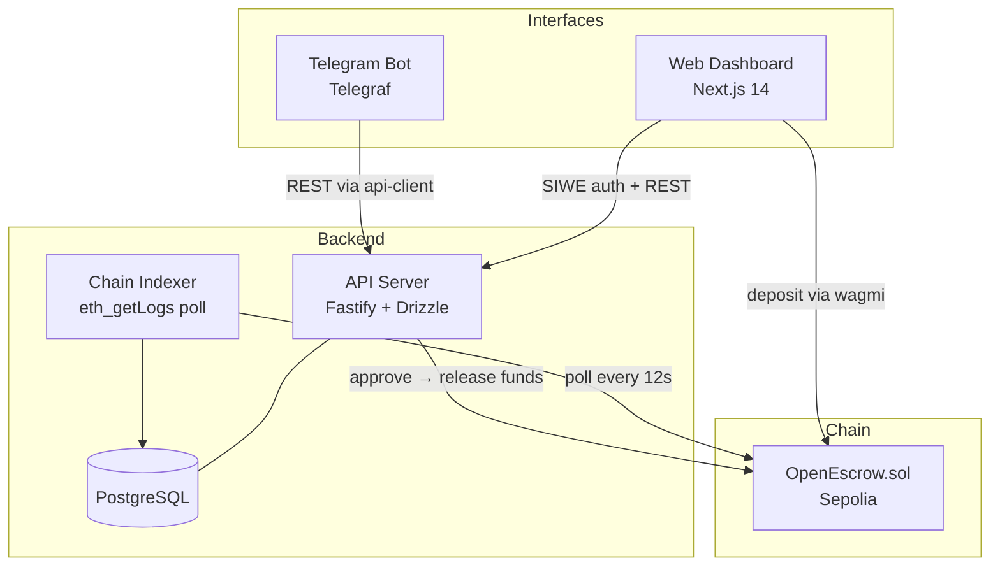
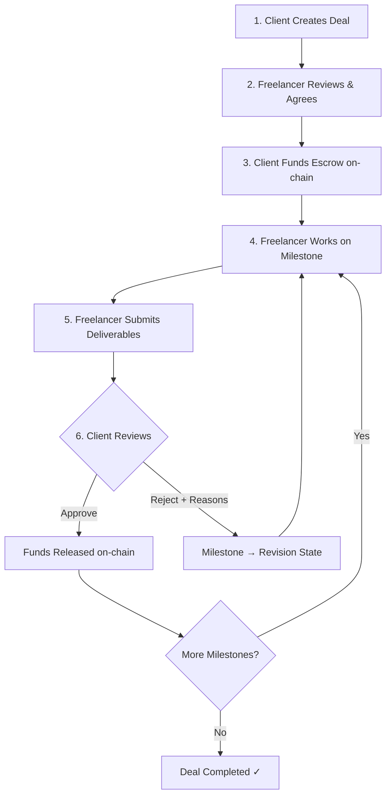

<div align="center">

# OpenEscrow

**Open-source, milestone-based on-chain escrow for freelancers & Web3 projects.**

[](LICENSE)
[](https://www.typescriptlang.org/)
[](https://soliditylang.org/)
[](https://github.com/baties/OpenEscrow/actions/workflows/ci.yml)
[](CONTRIBUTING.md)
[](https://github.com/baties/OpenEscrow)

**[Getting Started](#-getting-started) · [Architecture](#-architecture) · [Workflow](#-how-it-works) · [Roadmap](#-roadmap) · [Contributing](#-contributing)**

</div>

---

## Table of Contents

- [Why OpenEscrow](#-why-openescrow)
- [Core Features (MVP)](#-core-features-mvp)
- [Architecture](#-architecture)
- [Tech Stack](#-tech-stack)
- [Getting Started](#-getting-started)
  - [Prerequisites](#prerequisites)
  - [Setup](#setup)
  - [Development Mode](#development-mode)
  - [Smart Contract Development](#smart-contract-development)
- [Environment Variables](#-environment-variables)
- [How It Works](#-how-it-works)
- [Telegram Linking](#-telegram-linking)
- [Non-Goals (MVP)](#-non-goals-mvp)
- [Roadmap](#-roadmap)
- [Contributing](#-contributing)
- [Security](#-security)
- [License](#-license)
- [Acknowledgements](#-acknowledgements)
- [Disclaimer](#-disclaimer)

---

## 💡 Why OpenEscrow

Freelance projects — especially in Web3 — frequently break down over:

| Problem                                                | Impact                               |
| ------------------------------------------------------ | ------------------------------------ |
| **Vague scope** and unclear acceptance criteria        | Disputes over "done" vs. "not done"  |
| **Payment trust gap** (upfront risk vs. delivery risk) | Freelancers ghost, clients don't pay |
| **No structured dispute loop**                         | Projects stall, relationships break  |

OpenEscrow addresses this with:

- **On-chain escrow** — transparent, rule-based fund releases via smart contract
- **Structured milestone loop** — submit → approve / reject → revise → resubmit
- **Telegram as a secondary interface** — get notified and take action without leaving your chat app

---

## ✨ Core Features (MVP)

- Create escrow deals with **structured milestones** — each with title, description, acceptance criteria, and amount
- Fund escrow in **USDC or USDT** — no native tokens, no other ERC-20s
- Freelancer **submits** milestone deliverables (summary + links)
- Client **approves** (triggers on-chain fund release) or **rejects** with structured reasons
- **Auto-transition** to revision state after rejection — freelancer revises and resubmits
- **Audit trail** — full timeline of every action per deal (who did what, when)
- **Telegram bot** — receive deal notifications, approve/reject from inline keyboards
- **SIWE authentication** — one-click wallet sign-in (Sign-In With Ethereum); SIWE fires automatically on wallet connect, JWT session persists 24 hours

---

## 🏗 Architecture



### Monorepo Structure

| Package           | Description                                                               |
| ----------------- | ------------------------------------------------------------------------- |
| `apps/api`        | Fastify backend — SIWE auth, deal lifecycle, milestones, chain indexer    |
| `apps/web`        | Next.js 14 dashboard — wallet connect, client + freelancer flows          |
| `apps/bot`        | Telegraf Telegram bot — deal status, approve/reject, notification polling |
| `contracts`       | OpenEscrow.sol + Hardhat tests + Sepolia deploy scripts                   |
| `packages/shared` | TypeScript types, constants, and contract ABIs shared across all apps     |

---

## 🧰 Tech Stack

| Layer               | Technology                                                                     |
| ------------------- | ------------------------------------------------------------------------------ |
| **Smart Contracts** | Solidity 0.8.24 · Hardhat · OpenZeppelin (ReentrancyGuard, SafeERC20, Ownable) |
| **Backend API**     | TypeScript · Fastify · Drizzle ORM · PostgreSQL                                |
| **Auth**            | SIWE (Sign-In With Ethereum) · JWT session tokens                              |
| **Frontend**        | Next.js 14 (App Router) · React · Tailwind CSS · wagmi · viem · RainbowKit     |
| **Telegram Bot**    | TypeScript · Telegraf                                                          |
| **Validation**      | Zod — every API input and env config validated at startup                      |
| **Logging**         | pino — structured JSON logs throughout                                         |
| **Testing**         | Vitest (API + bot + web) · Hardhat (contracts)                                 |
| **Deployment**      | Docker · Docker Compose (single-server self-hosted)                            |
| **Target Chain**    | Ethereum Sepolia testnet (mainnet only after audit)                            |

---

## 🚀 Getting Started

### Prerequisites

| Tool                                                        | Version                    |
| ----------------------------------------------------------- | -------------------------- |
| [Node.js](https://nodejs.org/)                              | 22+                        |
| [pnpm](https://pnpm.io/)                                    | 9+ (`npm install -g pnpm`) |
| [Docker + Docker Compose](https://docs.docker.com/compose/) | v2+                        |

### Setup

```bash
# 1. Clone the repository
git clone https://github.com/baties/OpenEscrow.git
cd OpenEscrow

# 2. Install dependencies
pnpm install

# 3. Copy and configure environment variables
cp .env.example .env
# Edit .env — fill in required values (see Environment Variables section)

# 4. Start all services
docker compose up -d

# 5. Verify everything is running
docker compose ps                           # all 4 services healthy
curl http://localhost:3001/api/v1/health    # {"status":"ok","timestamp":"..."}
open http://localhost:3000                  # Web dashboard
```

Services start in dependency order: `postgres` → `api` → `web` + `bot`.

### Development Mode

```bash
# Run all tests
pnpm test

# Lint all packages
pnpm lint

# Build all packages (TypeScript check)
pnpm build

# View logs from a running service
docker compose logs -f api
docker compose logs -f bot
```

### Resetting All Data (Dev Testing)

During development and testing you will often want to wipe all deals, users, milestones, and Telegram links to start fresh. Use the `db:reset` script:

```bash
# From repo root (containers must be running so the API can reach PostgreSQL)
pnpm --filter @open-escrow/api db:reset

# Or from apps/api/
cd apps/api && pnpm db:reset
```

This truncates all 7 tables (`users`, `deals`, `milestones`, `submissions`, `deal_events`, `telegram_links`, `rejection_notes`) with `RESTART IDENTITY CASCADE`. The database schema and migrations are untouched — only the data is deleted.

> **Safety:** The script exits immediately with an error if `NODE_ENV=production`. It is safe to run on a VPS only in development mode.

After resetting, re-link your Telegram account (the bot session is cleared along with user data) and create new test deals.

### pgAdmin (Optional — Database Browser)

A developer-only compose file adds pgAdmin for browsing the PostgreSQL database. **Never deploy this to production.**

```bash
# Start full stack + pgAdmin
docker compose -f docker-compose.yml -f docker-compose.dev.yml up -d

# Or start only postgres + pgAdmin (run API/Web/Bot locally via pnpm dev)
docker compose -f docker-compose.yml -f docker-compose.dev.yml up -d postgres pgadmin
```

pgAdmin opens at **http://localhost:5050** — login: `admin@openescrow.dev` / `admin`.
The local PostgreSQL server is pre-configured — no manual setup needed.

### Smart Contract Development

```bash
# Compile contracts
pnpm --filter @open-escrow/contracts build

# Run contract tests (69 tests)
pnpm --filter @open-escrow/contracts test

# Deploy to Sepolia (requires DEPLOYER_PRIVATE_KEY in .env)
pnpm --filter @open-escrow/contracts deploy:sepolia

# Export ABI to packages/shared after deployment
pnpm --filter @open-escrow/contracts export-abi
```

---

## 🔑 Environment Variables

Copy `.env.example` and fill in the required values:

```bash
cp .env.example .env
```

All variables are validated at startup via Zod — the process exits immediately with a clear error message if a required value is missing or invalid.

<details>
<summary>Key variables that require real values</summary>

| Variable                               | How to get it                                                   |
| -------------------------------------- | --------------------------------------------------------------- |
| `JWT_SECRET`                           | `openssl rand -hex 64`                                          |
| `BOT_API_SECRET`                       | `openssl rand -hex 32`                                          |
| `POSTGRES_PASSWORD`                    | Any strong password                                             |
| `TELEGRAM_BOT_TOKEN`                   | [@BotFather](https://t.me/BotFather) on Telegram                |
| `NEXT_PUBLIC_WALLETCONNECT_PROJECT_ID` | [cloud.walletconnect.com](https://cloud.walletconnect.com)      |
| `RPC_URL`                              | Sepolia RPC from Alchemy / Infura / QuickNode                   |
| `CONTRACT_ADDRESS`                     | Output of `pnpm --filter @open-escrow/contracts deploy:sepolia` |
| `USDC_ADDRESS` / `USDT_ADDRESS`        | Sepolia token addresses (examples in `.env.example`)            |

</details>

---

## 🔁 How It Works



### Deal State Machine

| State       | Description                                             |
| ----------- | ------------------------------------------------------- |
| `DRAFT`     | Deal created by client, awaiting freelancer agreement   |
| `AGREED`    | Freelancer confirmed milestones and acceptance criteria |
| `FUNDED`    | Client deposited funds to smart contract                |
| `SUBMITTED` | Freelancer submitted milestone deliverables             |
| `APPROVED`  | Client approved — funds released on-chain               |
| `REJECTED`  | Client rejected with structured reasons                 |
| `REVISION`  | Freelancer revising after rejection (auto-set)          |
| `COMPLETED` | All milestones approved, deal finished (auto-set)       |
| `CANCELLED` | Deal cancelled — unreleased funds returned to client    |

---

## 📱 Telegram Linking

Telegram is a **secondary interface** — the backend API remains the single source of truth. All Telegram actions go through the API, which enforces roles and state transitions.

### Linking your account

1. Start the bot and run `/link`
2. The bot displays your Telegram user ID and instructions
3. Log into the web dashboard and enter the one-time code generated there
4. Your Telegram account is now linked — the bot will send deal notifications

### What Telegram can do after linking

- `/deals` — list your active deals
- `/status <dealId>` — view deal details and milestone status
- **Inline keyboards** — approve or reject milestones (client), confirm submissions (freelancer)
- **Notifications** — funded, submitted, approved, rejected, cancelled events pushed in real time (30s polling)

### Unlinking

Unlink anytime from the web dashboard — revokes bot access immediately.

---

## 🚫 Non-Goals (MVP)

These are explicitly **out of scope** for the initial release:

- Arbitration, dispute councils, or voting mechanisms _(no arbitration — only approve/reject/revise loop)_
- Native token or non-stablecoin support _(USDC and USDT only)_
- Multi-chain deployment _(Sepolia testnet only — mainnet after audit)_
- Email or magic-link authentication _(wallet sign-in only)_
- AI-assisted milestone drafting or submission summaries _(Phase 5, post-MVP)_

---

## 🗺 Roadmap

| Phase | Milestone                                                                                    | Status      |
| ----- | -------------------------------------------------------------------------------------------- | ----------- |
| 0     | **Repo Bootstrap** — monorepo, Docker, CI, shared types                                      | ✅ Done     |
| 1     | **Smart Contracts** — escrow, milestones, cancel/refund, events                              | ✅ Done     |
| 2     | **Backend API** — auth, deal lifecycle, chain indexer, Telegram linking                      | ✅ Done     |
| 3     | **Web Dashboard** — wallet connect, client + freelancer flows, timeline                      | ✅ Done     |
| 4     | **Telegram Bot** — commands, inline keyboards, notification polling                          | ✅ Done     |
| 5     | **AI Clarity Layer** — milestone drafts, submission summaries, revision notes via OpenAI     | ⏳ Post-MVP |
| 6     | **Hardening** — rate limits, circuit breakers, observability, mainnet deployment after audit | ⏳ Post-MVP |

---

## 🤝 Contributing

Contributions are welcome and greatly appreciated.

### Quick Start for Contributors

1. **Fork** the repository
2. **Create** a feature branch (`git checkout -b feature/your-feature`)
3. **Commit** your changes using [Conventional Commits](https://www.conventionalcommits.org/) (`feat:`, `fix:`, `chore:`, etc.)
4. **Run** `pnpm lint && pnpm test` — both must pass
5. **Push** and open a Pull Request

### Contribution Ideas

| Area                | Ideas                                                                       |
| ------------------- | --------------------------------------------------------------------------- |
| **Smart Contracts** | Gas optimizations, additional token support (post-MVP), formal verification |
| **Multi-chain**     | Deployment templates for Polygon, Arbitrum, Base                            |
| **Web Dashboard**   | UX improvements, mobile responsiveness, dark mode                           |
| **Telegram Bot**    | Richer inline keyboards, media support                                      |
| **AI Layer**        | Prompt templates, evaluation harness, local LLM support (Phase 5)           |
| **Security**        | Audit findings, fuzzing, static analysis integrations                       |
| **Docs**            | Tutorials, translations, self-hosting guides                                |

See [CONTRIBUTING.md](CONTRIBUTING.md) for the full guide.

---

## 🔒 Security

> **The OpenEscrow smart contracts have not been audited. Do NOT use on mainnet with real funds.**

- MVP targets **Sepolia testnet** only
- Contract mainnet deployment requires a professional security audit
- Never store private keys in code or commit them to the repository
- All secrets go in `.env` (gitignored)

### Reporting Vulnerabilities

Please report security vulnerabilities **responsibly** — do not open a public GitHub issue:

1. Use [GitHub Security Advisories](https://github.com/baties/OpenEscrow/security/advisories)
2. We will acknowledge within 48 hours and work with you on a coordinated fix

---

## 📄 License

This project is licensed under the **MIT License** — see the [LICENSE](LICENSE) file for details.

---

## 🙏 Acknowledgements

- [OpenZeppelin](https://openzeppelin.com/) — battle-tested smart contract security libraries
- [Hardhat](https://hardhat.org/) — Solidity development and testing environment
- [Fastify](https://fastify.dev/) — fast and low-overhead Node.js web framework
- [Drizzle ORM](https://orm.drizzle.team/) — TypeScript-first ORM with type-safe queries
- [wagmi](https://wagmi.sh/) + [viem](https://viem.sh/) — type-safe EVM hooks for React
- [RainbowKit](https://www.rainbowkit.com/) — wallet connection UI
- [Telegraf](https://telegraf.js.org/) — Telegram bot framework for Node.js

---

## ⚠️ Disclaimer

OpenEscrow is an open-source tool provided as-is. It does not provide financial, legal, or investment advice. Smart contracts may contain bugs. **Use at your own risk.** Always verify contract code and conduct your own security review before handling real funds.

---

<div align="center">

**[Report a Bug](https://github.com/baties/OpenEscrow/issues) · [Request a Feature](https://github.com/baties/OpenEscrow/issues) · [Discussions](https://github.com/baties/OpenEscrow/discussions)**

If you find OpenEscrow useful, please consider giving it a ⭐

</div>
